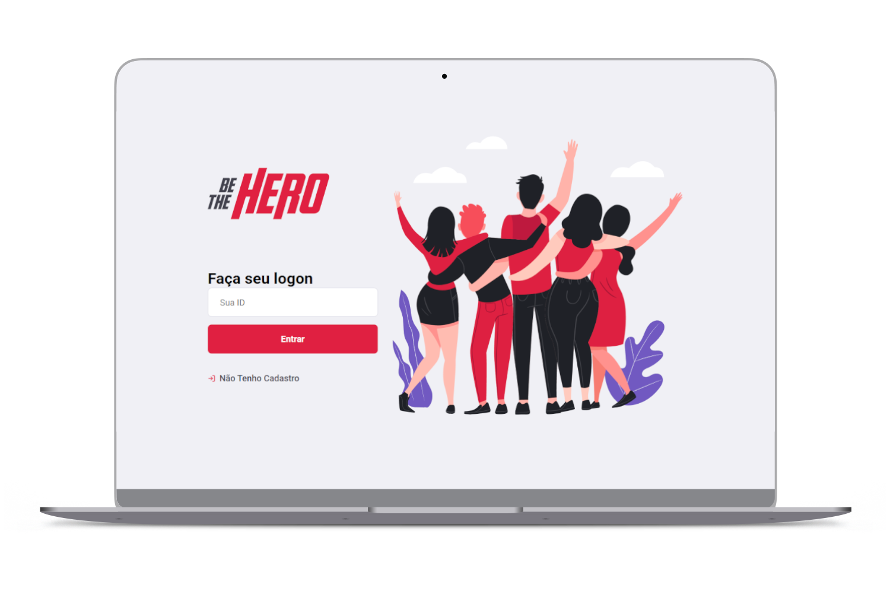
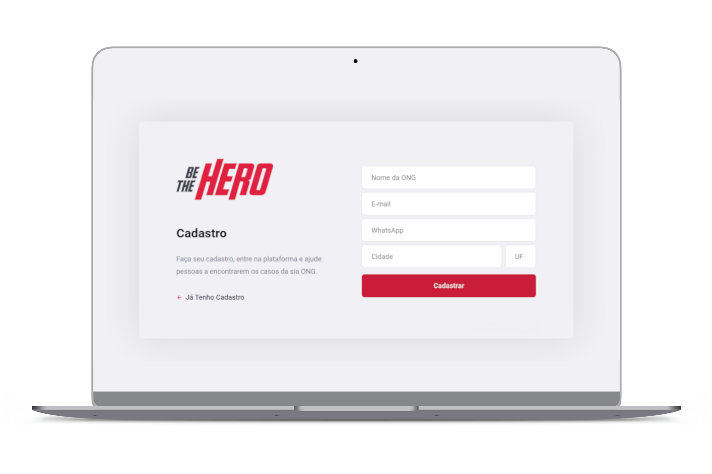
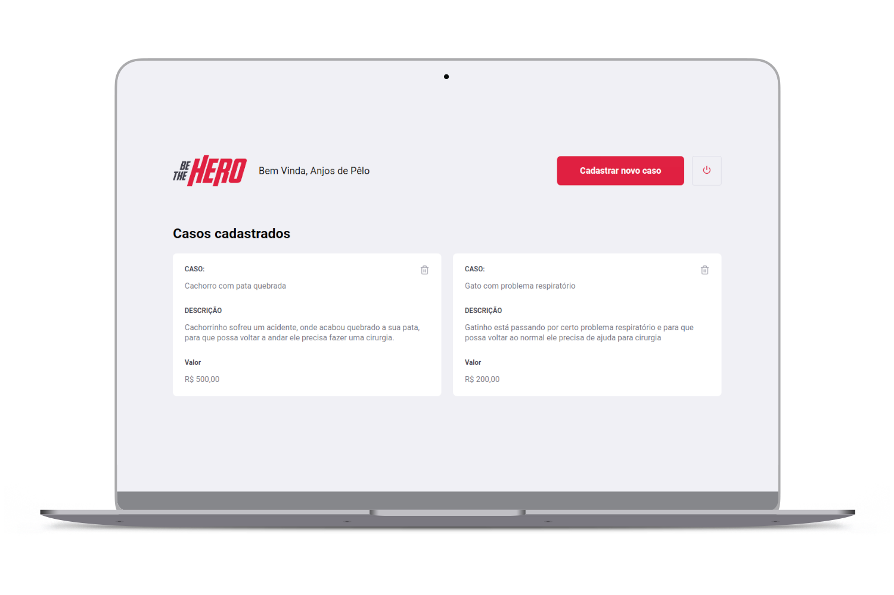
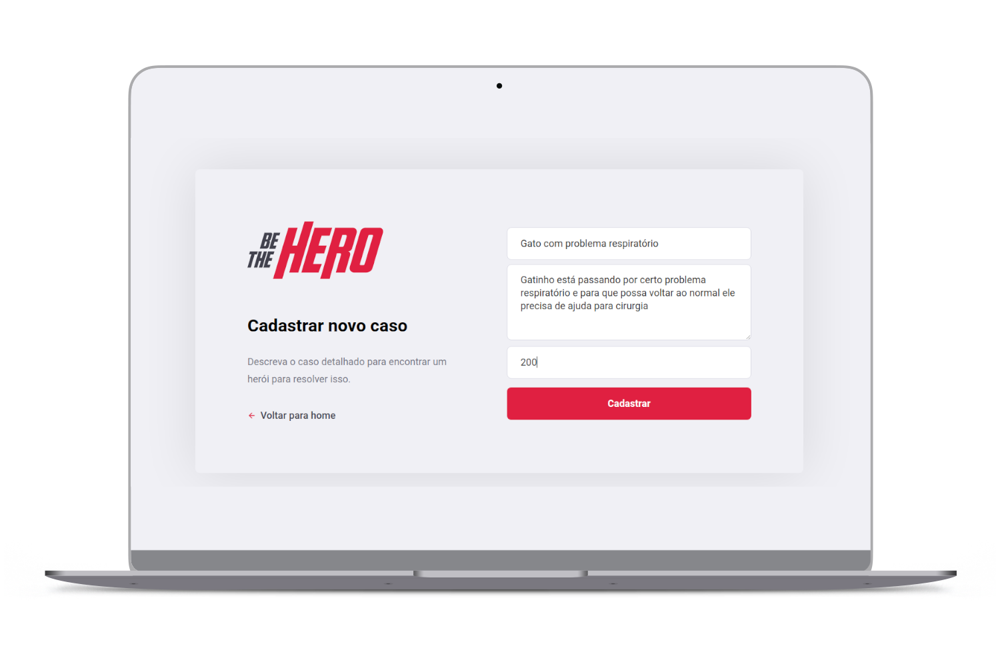

<h2 align="center">
  Projeto criado na 🚀 11º semana omnistack da skylab rocketseat
</h2>

<h6 align="center">
     
O BeTheHero é um projeto que visa conectar pessoas que desejam fazer contribuições monetárias a ONG's (Organizações não governamentais) que precisam de ajuda.
</h6>

<h5 align="center">
   
   
   
 ⋅ ────────────────────────────────────  ⊱ Telas ⊰  ──────────────────────────────────── ⋅  
</h5>

  
   
  
   
  
   
  

## 💻 Nesse projeto foi utilizado:  

 - ReactJS
 - NodeJS
 - Express
 - CORS
 - SQLite
 - React Native
 
