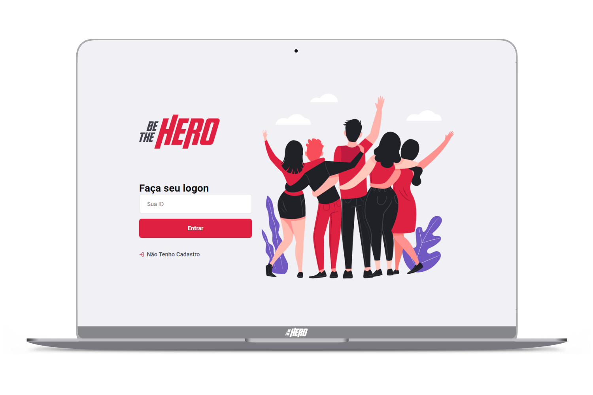
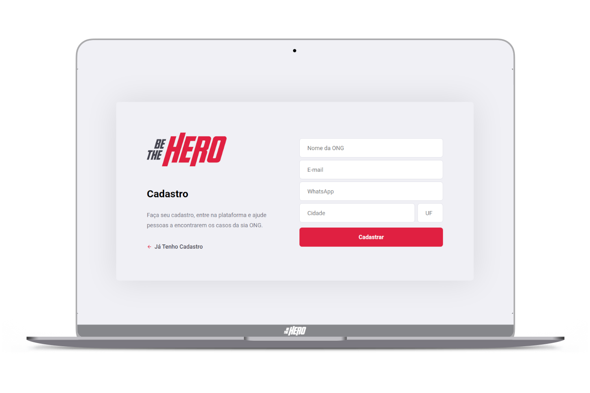
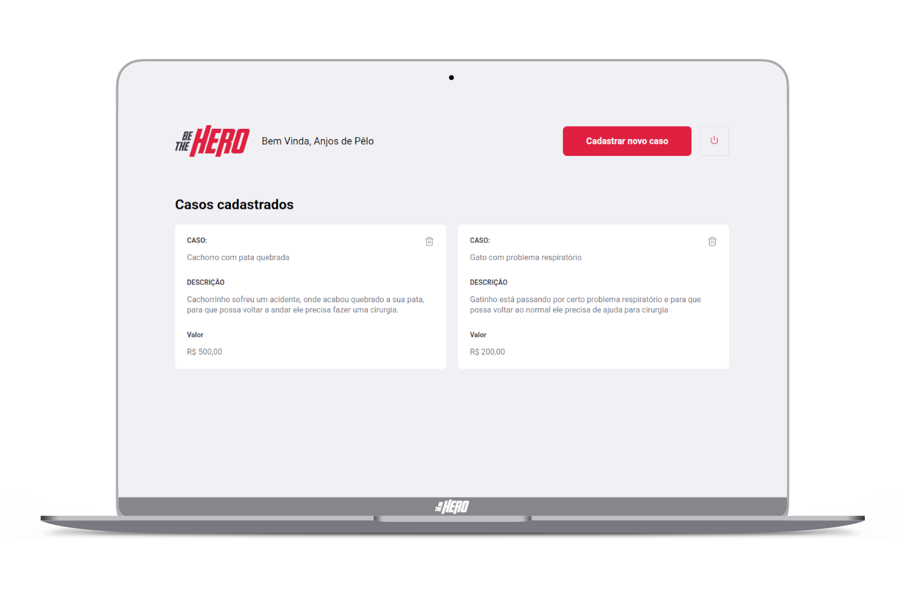
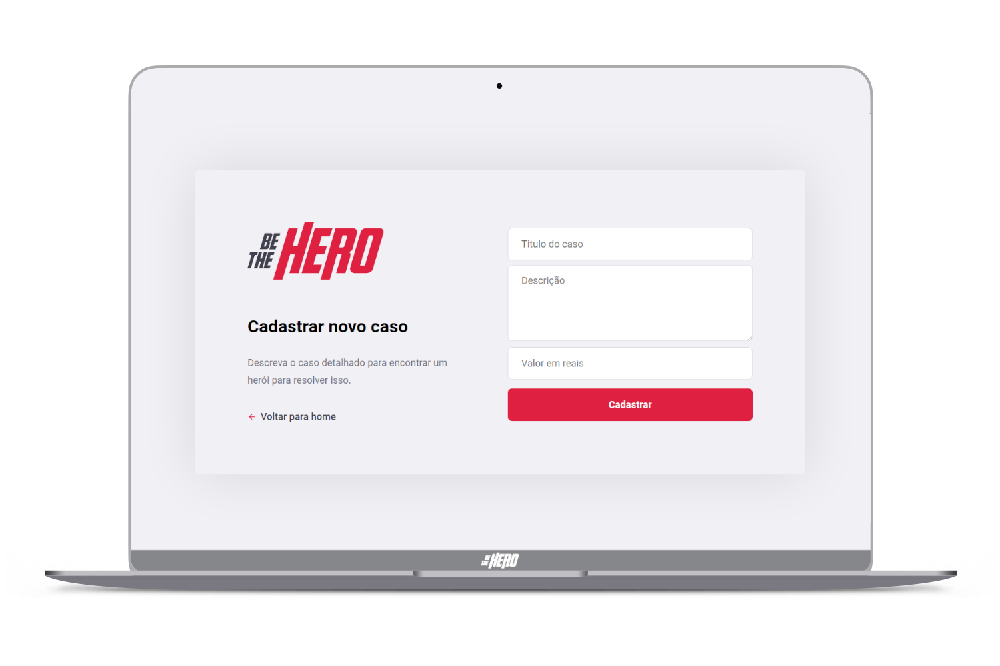

<h2 align="center">
  Projeto criado na 🚀&ensp; 11º semana omnistack da skylab rocketseat
</h2>

<strong align="center">
  
     
  O BeTheHero é um projeto que visa conectar pessoas que desejam fazer contribuições monetárias a
   
  ONG's que estão precisando de ajuda.
  
</strong>

<h5 align="center">
   
   
   
  ────────────────────────────────  👇🏻 &ensp;Telas - Desktop&ensp; 🖥️  ────────────────────────────────   
</h5>

  
   
  
   
  
   
  

## 💻&ensp; Tecnologias:
> As tecnologias utilizadas no desenvolvimento desse projeto foram:

- [Node.js](https://nodejs.org/en/)
- [React](https://reactjs.org)
- [React Native](https://facebook.github.io/react-native/) #ProjetoFaltando
 
 
