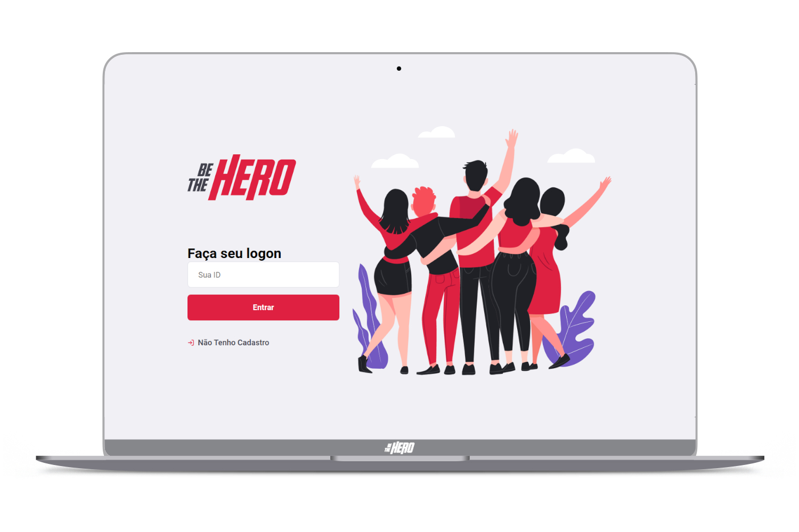
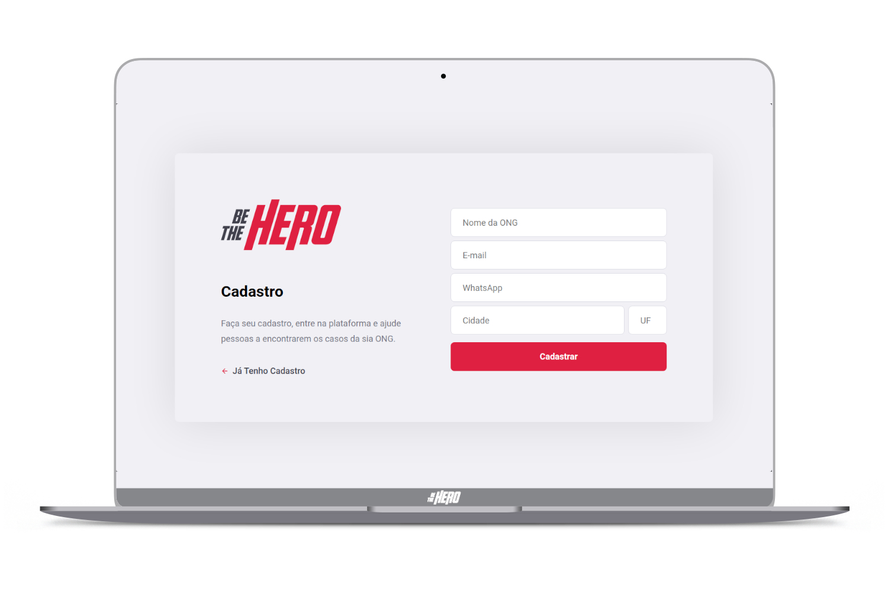
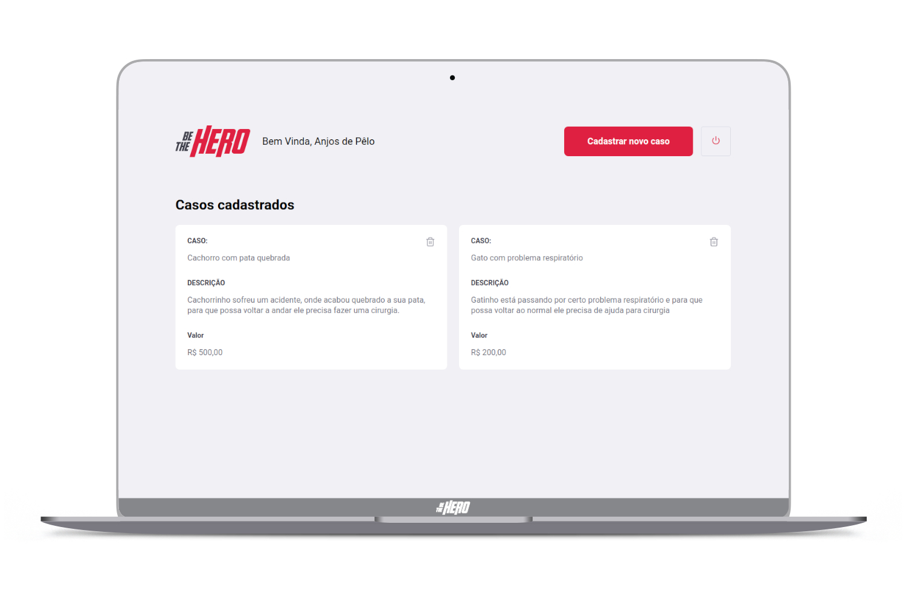
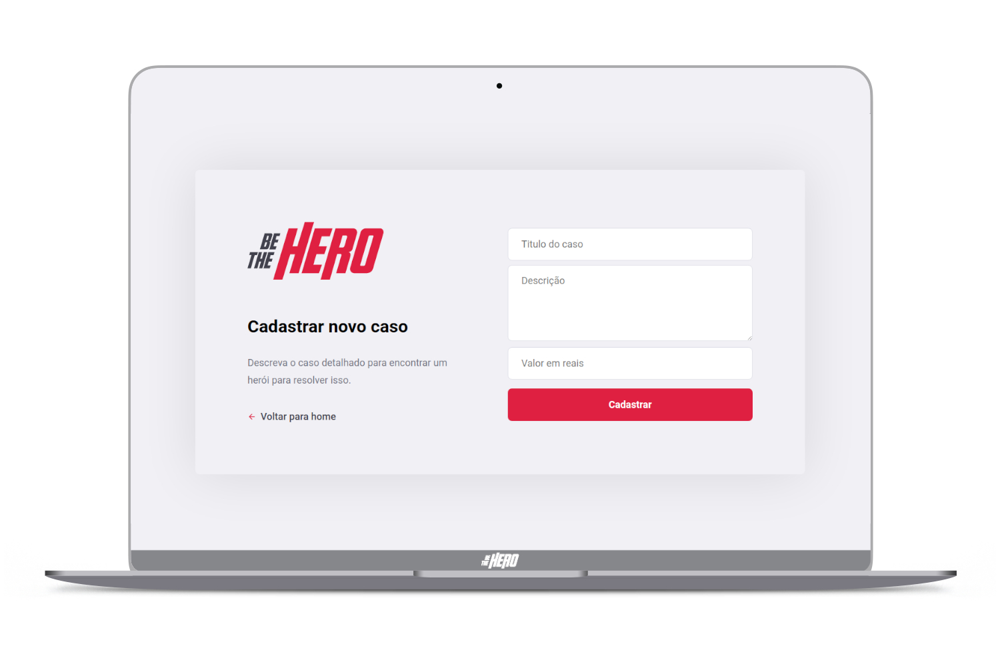

<h2 align="center">
  Projeto criado na 🚀 11º semana omnistack da skylab rocketseat
</h2>

<strong align="center">
  
     
  O BeTheHero é um projeto que visa conectar pessoas que desejam fazer contribuições monetárias a ONG's  
  que estão precisando de ajuda.
  
</strong>

<h5 align="center">
   
   
   
  ────────────────────────────────  👇🏻 Telas - Desktop 🖥️  ────────────────────────────────   
</h5>

  
   
  
   
  
   
  

## 💻 Nesse projeto foi utilizado:  

 - ReactJS
 - React Native 
 - NodeJS
 - Express
 - CORS
 - SQLite
 
 
